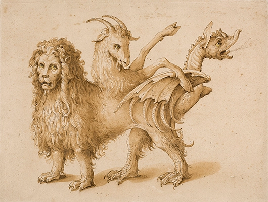
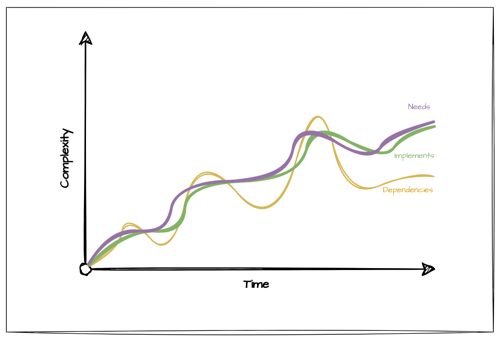

# Continuity

| ⚠️ __Warning__ ⚠️  |
|-|
| This Topic requires a lot more explanation to make sense to, well, anyone but me, but its a start! |

This is a big one. It covers pretty much every Thing. In my book, its a pattern recognized across time and space. Oxford might be bold enough to define it in terms of existence, but don't even get me started on existence or else we'll never get to the good Stuff.

[#]:> (EXPAND: blah blah business continuity blah blah)

## The Ship of Theseus

We won't get far discussing Continuity without first introducing the [Ship of
Theseus](https://en.wikipedia.org/wiki/Ship_of_Theseus) paradox. Go ahead and read that page now and come back!

[#]:> (POINT: Explain ship of theseus in own words)

Beyond this being a paradox it also shows how important the destination port is. The paradox can only be tested once the Ship has reached its destination. If your organisation doesn't have a clear vision it means you have no hope of continuity at all. Where there isn't a Point B, there be monsters.

## The Chimera

[The Chimera](https://en.wikipedia.org/wiki/Chimera_(mythology)) IS the most bad ass Greek monsters in town. Every pipe's got 'em, some are slain, but most remain.

[#]:> (EXPAND: point B is vision. Without vision you get a chimera. if everyone isn't aligned with that vision you get a chimera. if the vision is broken you get a chimera)

## Convergence

