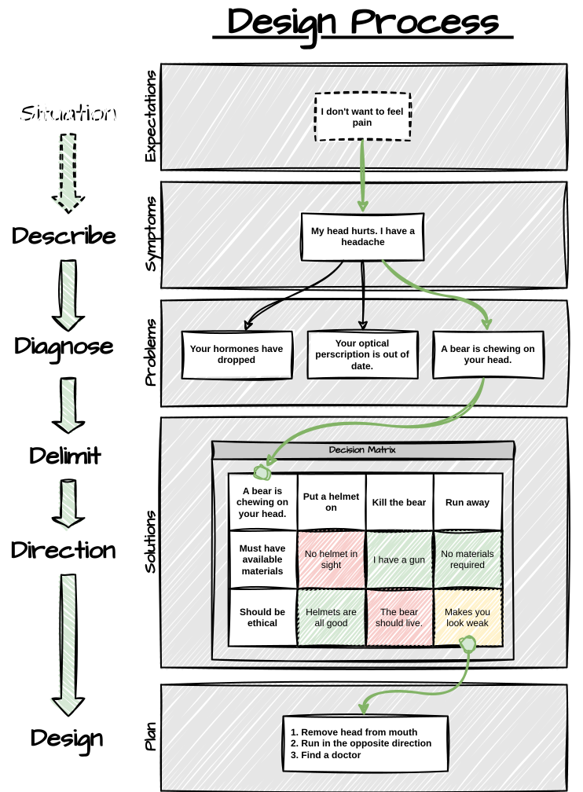

# Design

Design is often thought of as the process of making something beautiful. While this is true I feel Rich Hickey's talk ["Design in Practice"](https://www.youtube.com/watch?v=c5QF2HjHLSE&t=1928s&pp=ygUScmljaCBoaWNrZXkgZGVzaWdu) to be the most informative and inspiring explanation I've seen. It also felt like he wasn't trying to sell me some wonder framework that works in all cases. Following the talk I synthesized it into the following illustration describing the design process with a rather contrived situation.

